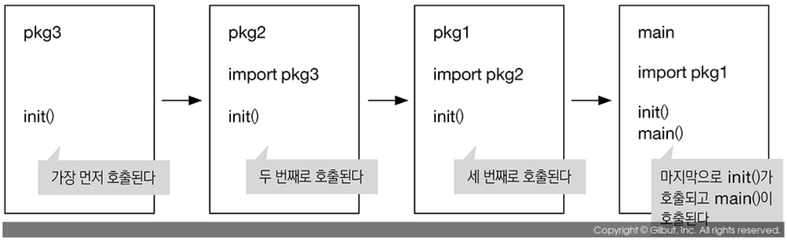

# 별칭
- 패키지 이름에 별칭을 줄 수 있다.
- 패키지 이름이 중복되거나 길때 사용한다.

```go
package main

import(
	"fmt"
	mylib "go-book-sample/ch2/lib"
)

func main() {
	fmt.Println(mylib.IsDigit('1'))
}
```

# Init 함수
- init 함수는 패키지가 로드될때 가장 먼저 호출되는 함수다.
- 패키지 초기화 로직이 필요할 때 사용한다.
```go
package main

import (
	"fmt"
	"go-book-sample/ch2/lib"
)

var v rune

func init() {
	v = '1'
}

func main() {
	fmt.Println(lib.IsDigit(v))
}

func IsDigit(c int32) bool {
	return '0' <= c && c <= '9'
}

// 실행결과: true
```

- GO 프로그램은 항상 main() 함수로 시작한다.
- 만약 main 패키지가 다른 패키지를 임포트하면, 임포트된 패키지를 먼저 부른다.
- 임포트된 패키지를 모두 불러온후 main() 함수가 실행된다.
- 패키지의 Init() 함수가 호출되는 순서는 가장 나중에 임포트된 패키지의 Init함수다

